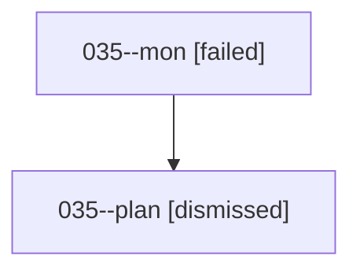

# Family: 035

[Agent Hoods](../README.md) / [bbugyi200](../users/bbugyi200/README.md) / [athena](../users/bbugyi200/machines/athena/README.md) / [035](../users/bbugyi200/machines/athena/hoods/035/README.md) / 035

Owner: `bbugyi200.athena` · Hood: `035` · Members: 2

## Lineage

The diagram is an optional enhancement; the ordered table below contains the same lineage in accessible text.

| Role | Agent | State | Model / provider | Timing | Commits | Prompt | Chat |
|---|---|---|---|---|---:|---|---|
| mon | 035--mon | failed | gpt-5.6-sol / codex | 2026-08-16T01:47:44.375525+00:00 | 0 | — | [Chat](../agents/bbugyi200.athena.035--mon/chat.md) |
| plan | 035--plan | dismissed | — | 2026-08-15T21:39:00 | 0 | — | — |

## Commits

| Role | Repo | Commit | Subject | Committed |
|---|---|---|---|---|
| — | sase | [`5aa9492`](https://github.com/sase-org/sase/commit/5aa9492438c99b9a1ab22a2e302432c06c4cf9c6) | chore: Add SDD prompt and plan for ctrl\_g\_prompt\_normal\_mode | 2026-06-21 10:16:18 EDT |
| — | sase | [`be9b975`](https://github.com/sase-org/sase/commit/be9b97517af00fda312efe6aa79b96e2ad0f3a0b) | feat(tui): enable Ctrl+G prompt prefix in NORMAL mode | 2026-06-21 10:33:51 EDT |
