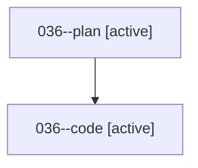

# Family: 036

[Agent Hoods](../README.md) / [bbugyi200](../users/bbugyi200/README.md) / [athena](../users/bbugyi200/machines/athena/README.md) / [036](../users/bbugyi200/machines/athena/hoods/036/README.md) / 036

Owner: `bbugyi200.athena` · Hood: `036` · Members: 2

## Lineage

The diagram is an optional enhancement; the ordered table below contains the same lineage in accessible text.

| Role | Agent | State | Model / provider | Timing | Commits | Prompt | Chat |
|---|---|---|---|---|---:|---|---|
| plan | 036--plan | active | opus / claude | 2026-08-16T01:44:47.353899+00:00 | 0 | [Prompt](../agents/bbugyi200.athena.036--plan/prompt.md) | [Chat](../agents/bbugyi200.athena.036--plan/chat.md) |
| code | 036--code | active | gpt-5.5 / codex | 2026-08-16T01:52:32.645508+00:00 | 0 | — | — |

## Neighbors

| Agent | Relation | State |
|---|---|---|
| [036.cdx](../agents/bbugyi200.athena.036.cdx/README.md) | descendant | completed |
