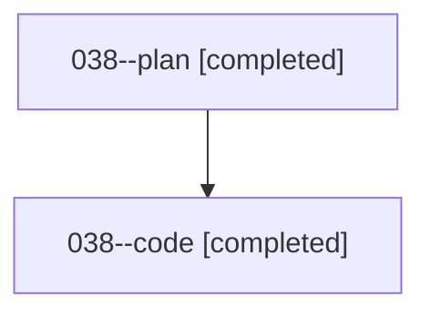

# Family: 038

[Agent Hoods](../README.md) / [bbugyi200](../users/bbugyi200/README.md) / [athena](../users/bbugyi200/machines/athena/README.md) / [038](../users/bbugyi200/machines/athena/hoods/038/README.md) / 038

Owner: `bbugyi200.athena` · Hood: `038` · Members: 2

## Lineage

The diagram is an optional enhancement; the ordered table below contains the same lineage in accessible text.

| Role | Agent | State | Model / provider | Timing | Commits | Prompt | Chat |
|---|---|---|---|---|---:|---|---|
| plan | 038--plan | completed | opus / claude | 2026-08-16T02:11:57.001064+00:00 | 0 | [Prompt](../agents/bbugyi200.athena.038--plan/prompt.md) | [Chat](../agents/bbugyi200.athena.038--plan/chat.md) |
| code | 038--code | completed | sonnet / claude | 2026-08-16T02:21:50.661954+00:00 | [1](../agents/bbugyi200.athena.038--code/README.md#commits) | — | [Chat](../agents/bbugyi200.athena.038--code/chat.md) |

## Commits

| Role | Repo | Commit | Subject | Committed |
|---|---|---|---|---|
| code | sase | [`f935aca`](https://github.com/sase-org/sase/commit/f935acacee35d7261aa3b4dbe0bd57342e09d43d) | fix(bead): name concrete field diff in append-only rewrite guard message | 2026-08-15 22:58:39 EDT |

## Neighbors

| Agent | Relation | State |
|---|---|---|
| [038.cld](../agents/bbugyi200.athena.038.cld/README.md) | descendant | completed |
| [038.f0](../agents/bbugyi200.athena.038.f0/README.md) | descendant | dismissed |
| [038.f1](../agents/bbugyi200.athena.038.f1/README.md) | descendant | active |
| [038.f2](../agents/bbugyi200.athena.038.f2/README.md) | descendant | active |
