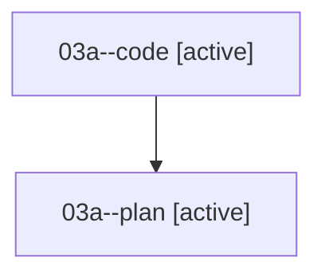

# Family: 03a

[Agent Hoods](../README.md) / [bbugyi200](../users/bbugyi200/README.md) / [athena](../users/bbugyi200/machines/athena/README.md) / [03a](../users/bbugyi200/machines/athena/hoods/03a/README.md) / 03a

Owner: `bbugyi200.athena` · Hood: `03a` · Members: 2

## Lineage

The diagram is an optional enhancement; the ordered table below contains the same lineage in accessible text.

| Role | Agent | State | Model / provider | Timing | Commits | Prompt | Chat |
|---|---|---|---|---|---:|---|---|
| code | 03a--code | active | gpt-5.5 / codex | 2026-08-16T13:20:28.876291+00:00 | [1](../agents/bbugyi200.athena.03a--code/README.md#commits) | — | — |
| plan | 03a--plan | active | opus / claude | 2026-08-16T13:07:16.765476+00:00 | 0 | [Prompt](../agents/bbugyi200.athena.03a--plan/prompt.md) | [Chat](../agents/bbugyi200.athena.03a--plan/chat.md) |

## Commits

| Role | Repo | Commit | Subject | Committed |
|---|---|---|---|---|
| code | sase | [`2aa8ba2`](https://github.com/sase-org/sase/commit/2aa8ba26f7efc6522a7cc28e969c688a3f870b18) | fix(tui): release stale prompt context after launch | 2026-08-16 09:46:28 EDT |
