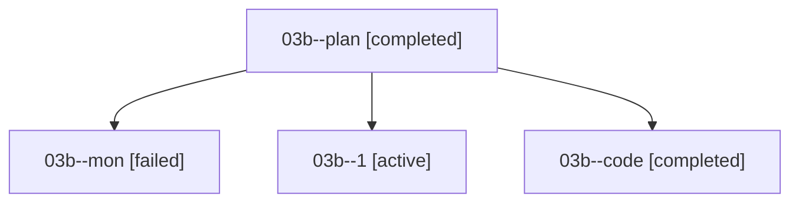

# Family: 03b

[Agent Hoods](../README.md) / [bbugyi200](../users/bbugyi200/README.md) / [athena](../users/bbugyi200/machines/athena/README.md) / [03b](../users/bbugyi200/machines/athena/hoods/03b/README.md) / 03b

Owner: `bbugyi200.athena` · Hood: `03b` · Members: 4

## Lineage

The diagram is an optional enhancement; the ordered table below contains the same lineage in accessible text.

| Role | Agent | State | Model / provider | Timing | Commits | Prompt | Chat |
|---|---|---|---|---|---:|---|---|
| plan | 03b--plan | completed | gpt-5.6-sol / codex | 2026-08-16T13:11:51.853867+00:00 | 0 | [Prompt](../agents/bbugyi200.athena.03b--plan/prompt.md) | [Chat](../agents/bbugyi200.athena.03b--plan/chat.md) |
| mon | 03b--mon | failed | grok-4.6 / grok | 2026-08-16T14:06:23.320812+00:00 | 0 | — | [Chat](../agents/bbugyi200.athena.03b--mon/chat.md) |
| 1 | 03b--1 | active | grok-4.6 / grok | 2026-08-16T14:28:12.458975+00:00 | [1](../agents/bbugyi200.athena.03b--1/README.md#commits) | [Prompt](../agents/bbugyi200.athena.03b--1/prompt.md) | — |
| code | 03b--code | completed | grok-4.6 / grok | 2026-08-16T13:29:08.374841+00:00 | 0 | — | [Chat](../agents/bbugyi200.athena.03b--code/chat.md) |

## Commits

| Role | Repo | Commit | Subject | Committed |
|---|---|---|---|---|
| 1 | sase | [`e388740`](https://github.com/sase-org/sase/commit/e38874024bc15b39c61bec2e7c4ad776e2f923c7) | fix(proc): isolate SASE\_PROC\_\* tests, skip malformed monitors, overlay session workers | 2026-08-16 10:48:50 EDT |
