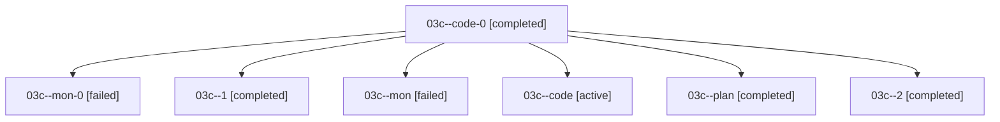

# Family: 03c

[Agent Hoods](../README.md) / [bbugyi200](../users/bbugyi200/README.md) / [athena](../users/bbugyi200/machines/athena/README.md) / [03c](../users/bbugyi200/machines/athena/hoods/03c/README.md) / 03c

Owner: `bbugyi200.athena` · Hood: `03c` · Members: 7

## Lineage

The diagram is an optional enhancement; the ordered table below contains the same lineage in accessible text.

| Role | Agent | State | Model / provider | Timing | Commits | Prompt | Chat |
|---|---|---|---|---|---:|---|---|
| code-0 | 03c--code-0 | completed | gpt-5.5 / codex | 2026-08-16T13:29:21.766616+00:00 | [1](../agents/bbugyi200.athena.03c--code-0/README.md#commits) | — | [Chat](../agents/bbugyi200.athena.03c--code-0/chat.md) |
| mon-0 | 03c--mon-0 | failed | opus / claude | 2026-08-16T14:37:02.359194+00:00 | 0 | — | [Chat](../agents/bbugyi200.athena.03c--mon-0/chat.md) |
| 1 | 03c--1 | completed | opus / claude | 2026-08-16T14:27:28.871140+00:00 | 0 | [Prompt](../agents/bbugyi200.athena.03c--1/prompt.md) | [Chat](../agents/bbugyi200.athena.03c--1/chat.md) |
| mon | 03c--mon | failed | opus / claude | 2026-08-16T14:05:25.113930+00:00 | 0 | — | [Chat](../agents/bbugyi200.athena.03c--mon/chat.md) |
| code | 03c--code | active | sonnet / claude | 2026-08-16T13:27:33.641983+00:00 | 0 | — | [Chat](../agents/bbugyi200.athena.03c--code/chat.md) |
| plan | 03c--plan | completed | opus / claude | 2026-08-16T13:14:09.597359+00:00 | 0 | [Prompt](../agents/bbugyi200.athena.03c--plan/prompt.md) | [Chat](../agents/bbugyi200.athena.03c--plan/chat.md) |
| 2 | 03c--2 | completed | opus / claude | 2026-08-16T14:51:01.441693+00:00 | [1](../agents/bbugyi200.athena.03c--2/README.md#commits) | [Prompt](../agents/bbugyi200.athena.03c--2/prompt.md) | [Chat](../agents/bbugyi200.athena.03c--2/chat.md) |

## Commits

| Role | Repo | Commit | Subject | Committed |
|---|---|---|---|---|
| code-0 | sase | [`78a9130`](https://github.com/sase-org/sase/commit/78a9130f753609fab8a6adb9d3245afb05574d46) | fix(tui): honor Artifacts pane contract actions | 2026-08-16 14:06:26 UTC |
| 2 | sase | [`5d0bcf9`](https://github.com/sase-org/sase/commit/5d0bcf9e8a389fdb47d1d612c0191bd730b5dfc2) | test: expect relation-backed fields in the notes fixture query profile | 2026-08-16 15:00:59 UTC |

## Neighbors

| Agent | Relation | State |
|---|---|---|
| [03c.cld](../agents/bbugyi200.athena.03c.cld/README.md) | descendant | completed |
