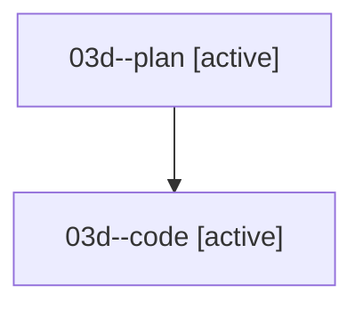

# Family: 03d

[Agent Hoods](../README.md) / [bbugyi200](../users/bbugyi200/README.md) / [athena](../users/bbugyi200/machines/athena/README.md) / [03d](../users/bbugyi200/machines/athena/hoods/03d/README.md) / 03d

Owner: `bbugyi200.athena` · Hood: `03d` · Members: 2

## Lineage

The diagram is an optional enhancement; the ordered table below contains the same lineage in accessible text.

| Role | Agent | State | Model / provider | Timing | Commits | Prompt | Chat |
|---|---|---|---|---|---:|---|---|
| plan | 03d--plan | active | gpt-5.6-sol / codex | 2026-08-16T13:19:40.135821+00:00 | 0 | [Prompt](../agents/bbugyi200.athena.03d--plan/prompt.md) | [Chat](../agents/bbugyi200.athena.03d--plan/chat.md) |
| code | 03d--code | active | sonnet / claude | 2026-08-16T13:38:26.592817+00:00 | 0 | — | — |
