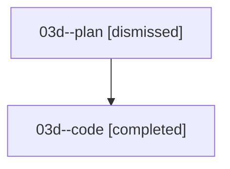

# Family: 03d

[Agent Hoods](../README.md) / [bbugyi200](../users/bbugyi200/README.md) / [athena](../users/bbugyi200/machines/athena/README.md) / [03d](../users/bbugyi200/machines/athena/hoods/03d/README.md) / 03d

Owner: `bbugyi200.athena` · Hood: `03d` · Members: 2

## Lineage

The diagram is an optional enhancement; the ordered table below contains the same lineage in accessible text.

| Role | Agent | State | Model / provider | Timing | Commits | Prompt | Chat |
|---|---|---|---|---|---:|---|---|
| plan | 03d--plan | dismissed | — | 2026-08-16T09:19:28 | 0 | — | — |
| code | 03d--code | completed | sonnet / claude | 2026-08-16T13:38:26.592817+00:00 | [1](../agents/bbugyi200.athena.03d--code/README.md#commits) | — | [Chat](../agents/bbugyi200.athena.03d--code/chat.md) |

## Commits

| Role | Repo | Commit | Subject | Committed |
|---|---|---|---|---|
| code | sase | [`5f84b41`](https://github.com/sase-org/sase/commit/5f84b41e7f51df80d09a32128ee4ba7045a8ed3f) | fix(tui): restore prompt Agents-tab freshness without broad reloads | 2026-08-16 10:28:24 EDT |
