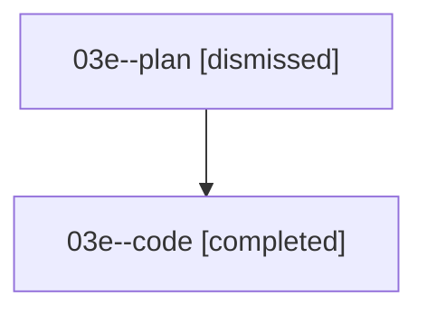

# Family: 03e

[Agent Hoods](../README.md) / [bbugyi200](../users/bbugyi200/README.md) / [athena](../users/bbugyi200/machines/athena/README.md) / [03e](../users/bbugyi200/machines/athena/hoods/03e/README.md) / 03e

Owner: `bbugyi200.athena` · Hood: `03e` · Members: 2

## Lineage

The diagram is an optional enhancement; the ordered table below contains the same lineage in accessible text.

| Role | Agent | State | Model / provider | Timing | Commits | Prompt | Chat |
|---|---|---|---|---|---:|---|---|
| plan | 03e--plan | dismissed | — | 2026-08-16T09:28:43 | 0 | — | — |
| code | 03e--code | completed | grok-4.6 / grok | 2026-08-16T13:39:02.657566+00:00 | [1](../agents/bbugyi200.athena.03e--code/README.md#commits) | — | [Chat](../agents/bbugyi200.athena.03e--code/chat.md) |

## Commits

| Role | Repo | Commit | Subject | Committed |
|---|---|---|---|---|
| code | sase | [`f12e241`](https://github.com/sase-org/sase/commit/f12e241a80b6e8538d95a47e6261ea969871f7ad) | fix(sdd): recover approval-time plan archive from rejected push | 2026-08-16 14:30:04 UTC |

## Neighbors

| Agent | Relation | State |
|---|---|---|
| [03e.cdx](../agents/bbugyi200.athena.03e.cdx/README.md) | descendant | completed |
| [03e.cdx.f1](../agents/bbugyi200.athena.03e.cdx.f1/README.md) | descendant | completed |
