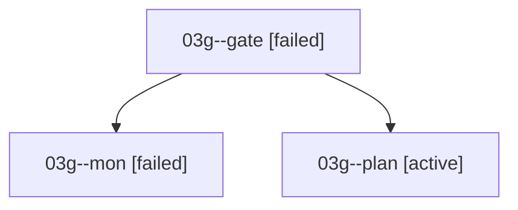

# Family: 03g

[Agent Hoods](../README.md) / [bbugyi200](../users/bbugyi200/README.md) / [athena](../users/bbugyi200/machines/athena/README.md) / [03g](../users/bbugyi200/machines/athena/hoods/03g/README.md) / 03g

Owner: `bbugyi200.athena` · Hood: `03g` · Members: 3

## Lineage

The diagram is an optional enhancement; the ordered table below contains the same lineage in accessible text.

| Role | Agent | State | Model / provider | Timing | Commits | Prompt | Chat |
|---|---|---|---|---|---:|---|---|
| gate | 03g--gate | failed | gpt-6-astra / codex | 2026-09-07T14:50:54.321255+00:00 → 2026-09-07T14:51:37.600273+00:00 | 0 | — | [Chat](../agents/bbugyi200.athena.03g--gate/chat.md) |
| mon | 03g--mon | failed | gpt-6-astra / codex | 2026-09-07T14:51:36.404007+00:00 → 2026-09-07T14:53:42.359179+00:00 | 0 | — | [Chat](../agents/bbugyi200.athena.03g--mon/chat.md) |
| plan | 03g--plan | active | gpt-6-astra / codex | 2026-09-07T14:36:31.583083+00:00 | 0 | [Prompt](../agents/bbugyi200.athena.03g--plan/prompt.md) | [Chat](../agents/bbugyi200.athena.03g--plan/chat.md) |

## Commits

| Role | Repo | Commit | Subject | Committed |
|---|---|---|---|---|
| — | sase | [`959c680`](https://github.com/sase-org/sase/commit/959c68045ad3ac27f397e12b3c5eb576b8471992) | chore: Add SDD prompt and plan for expand\_xprompt\_with\_inputs | 2026-06-22 07:57:25 EDT |
| — | sase | [`620ccda`](https://github.com/sase-org/sase/commit/620ccda1c20a256070eac1f53c411514a214598d) | feat(ace): inline expand xprompts with inputs | 2026-06-22 08:08:09 EDT |

## Neighbors

| Agent | Relation | State |
|---|---|---|
| [03g.f1](../agents/bbugyi200.athena.03g.f1/README.md) | descendant | completed |
