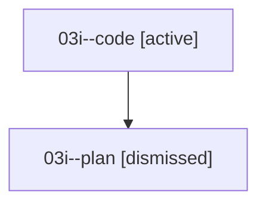

# Family: 03i

[Agent Hoods](../README.md) / [bbugyi200](../users/bbugyi200/README.md) / [athena](../users/bbugyi200/machines/athena/README.md) / [03i](../users/bbugyi200/machines/athena/hoods/03i/README.md) / 03i

Owner: `bbugyi200.athena` · Hood: `03i` · Members: 2

## Lineage

The diagram is an optional enhancement; the ordered table below contains the same lineage in accessible text.

| Role | Agent | State | Model / provider | Timing | Commits | Prompt | Chat |
|---|---|---|---|---|---:|---|---|
| code | 03i--code | active | gpt-5.5 / codex | 2026-08-16T14:10:29.380806+00:00 | 0 | — | — |
| plan | 03i--plan | dismissed | — | 2026-08-16T09:54:55 | 0 | — | — |

## Commits

| Role | Repo | Commit | Subject | Committed |
|---|---|---|---|---|
| — | sase | [`2a587ff`](https://github.com/sase-org/sase/commit/2a587fff70c2cb43035eaa340915291026028eca) | fix: reconcile phantom running procs | 2026-08-16 14:53:58 UTC |
