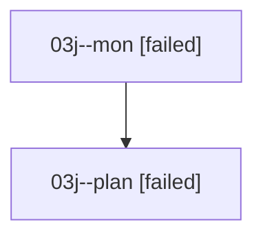

# Family: 03j

[Agent Hoods](../README.md) / [bbugyi200](../users/bbugyi200/README.md) / [athena](../users/bbugyi200/machines/athena/README.md) / [03j](../users/bbugyi200/machines/athena/hoods/03j/README.md) / 03j

Owner: `bbugyi200.athena` · Hood: `03j` · Members: 2

## Lineage

The diagram is an optional enhancement; the ordered table below contains the same lineage in accessible text.

| Role | Agent | State | Model / provider | Timing | Commits | Prompt | Chat |
|---|---|---|---|---|---:|---|---|
| mon | 03j--mon | failed | opus / claude | 2026-08-16T14:33:16.810512+00:00 | 0 | — | [Chat](../agents/bbugyi200.athena.03j--mon/chat.md) |
| plan | 03j--plan | failed | opus / claude | 2026-08-16T14:10:20.222822+00:00 | 0 | [Prompt](../agents/bbugyi200.athena.03j--plan/prompt.md) | [Chat](../agents/bbugyi200.athena.03j--plan/chat.md) |

## Commits

| Role | Repo | Commit | Subject | Committed |
|---|---|---|---|---|
| — | sase | [`ab0a48c`](https://github.com/sase-org/sase/commit/ab0a48c0b963fc0529647795552e16a3de721a60) | chore: Add SDD prompt and plan for fix\_ctrl\_n\_vcs\_mru\_cycling | 2026-06-22 12:12:23 UTC |
| — | sase | [`1dd07e9`](https://github.com/sase-org/sase/commit/1dd07e9fe4f259bb7fbae2966b2270a0df9377e3) | fix(ace): restore bidirectional Ctrl+N VCS MRU cycling | 2026-06-22 12:22:32 UTC |
