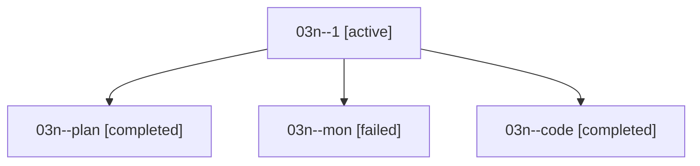

# Family: 03n

[Agent Hoods](../README.md) / [bbugyi200](../users/bbugyi200/README.md) / [athena](../users/bbugyi200/machines/athena/README.md) / [03n](../users/bbugyi200/machines/athena/hoods/03n/README.md) / 03n

Owner: `bbugyi200.athena` · Hood: `03n` · Members: 4

## Lineage

The diagram is an optional enhancement; the ordered table below contains the same lineage in accessible text.

| Role | Agent | State | Model / provider | Timing | Commits | Prompt | Chat |
|---|---|---|---|---|---:|---|---|
| 1 | 03n--1 | active | opus / claude | 2026-08-16T15:41:05.985979+00:00 | 0 | [Prompt](../agents/bbugyi200.athena.03n--1/prompt.md) | — |
| plan | 03n--plan | completed | opus / claude | 2026-08-16T14:58:14.093012+00:00 | 0 | [Prompt](../agents/bbugyi200.athena.03n--plan/prompt.md) | [Chat](../agents/bbugyi200.athena.03n--plan/chat.md) |
| mon | 03n--mon | failed | opus / claude | 2026-08-16T15:25:00.545512+00:00 | 0 | — | [Chat](../agents/bbugyi200.athena.03n--mon/chat.md) |
| code | 03n--code | completed | gpt-5.5 / codex | 2026-08-16T15:14:52.062993+00:00 | [1](../agents/bbugyi200.athena.03n--code/README.md#commits) | — | [Chat](../agents/bbugyi200.athena.03n--code/chat.md) |

## Commits

| Role | Repo | Commit | Subject | Committed |
|---|---|---|---|---|
| code | sase | [`3a37168`](https://github.com/sase-org/sase/commit/3a37168ccf023d61fecd58d50e407479a511a7af) | fix(finalizer): ignore hidden agents sidecar cleanup | 2026-08-16 15:26:14 UTC |
