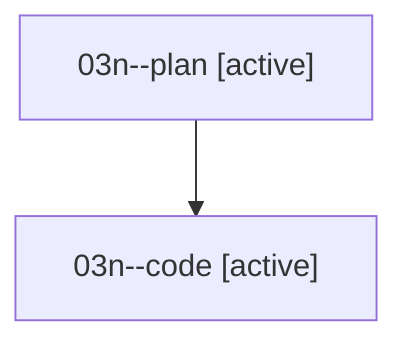

# Family: 03n

[Agent Hoods](../README.md) / [bbugyi200](../users/bbugyi200/README.md) / [athena](../users/bbugyi200/machines/athena/README.md) / [03n](../users/bbugyi200/machines/athena/hoods/03n/README.md) / 03n

Owner: `bbugyi200.athena` · Hood: `03n` · Members: 2

## Lineage

The diagram is an optional enhancement; the ordered table below contains the same lineage in accessible text.

| Role | Agent | State | Model / provider | Timing | Commits | Prompt | Chat |
|---|---|---|---|---|---:|---|---|
| plan | 03n--plan | active | opus / claude | 2026-08-16T14:58:14.093012+00:00 | 0 | [Prompt](../agents/bbugyi200.athena.03n--plan/prompt.md) | [Chat](../agents/bbugyi200.athena.03n--plan/chat.md) |
| code | 03n--code | active | gpt-5.5 / codex | 2026-08-16T15:14:52.062993+00:00 | 0 | — | — |
