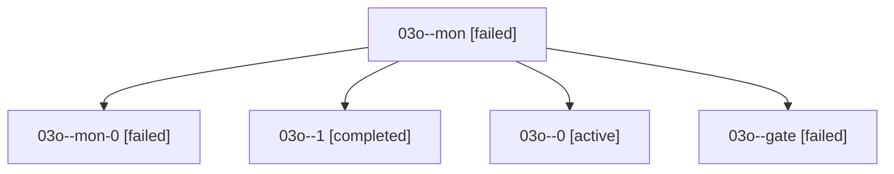

# Family: 03o

[Agent Hoods](../README.md) / [bbugyi200](../users/bbugyi200/README.md) / [athena](../users/bbugyi200/machines/athena/README.md) / [03o](../users/bbugyi200/machines/athena/hoods/03o/README.md) / 03o

Owner: `bbugyi200.athena` · Hood: `03o` · Members: 5

## Lineage

The diagram is an optional enhancement; the ordered table below contains the same lineage in accessible text.

| Role | Agent | State | Model / provider | Timing | Commits | Prompt | Chat |
|---|---|---|---|---|---:|---|---|
| mon | 03o--mon | failed | gpt-6-astra / codex | 2026-09-07T16:27:44.371817+00:00 → 2026-09-07T16:43:58.418639+00:00 | 0 | — | [Chat](../agents/bbugyi200.athena.03o--mon/chat.md) |
| mon-0 | 03o--mon-0 | failed | gpt-6-astra / codex | 2026-09-07T17:01:28.852576+00:00 → 2026-09-07T17:03:52.775362+00:00 | 0 | — | [Chat](../agents/bbugyi200.athena.03o--mon-0/chat.md) |
| 1 | 03o--1 | completed | gpt-6-astra / codex | 2026-09-07T16:44:48.817018+00:00 → 2026-09-07T16:47:11.079505+00:00 | 0 | [Prompt](../agents/bbugyi200.athena.03o--1/prompt.md) | [Chat](../agents/bbugyi200.athena.03o--1/chat.md) |
| 0 | 03o--0 | active | gpt-6-astra / codex | 2026-09-07T16:13:13.121460+00:00 | 0 | [Prompt](../agents/bbugyi200.athena.03o--0/prompt.md) | [Chat](../agents/bbugyi200.athena.03o--0/chat.md) |
| gate | 03o--gate | failed | gpt-6-astra / codex | 2026-09-07T16:47:03.066189+00:00 → 2026-09-07T17:01:30.876963+00:00 | 0 | — | [Chat](../agents/bbugyi200.athena.03o--gate/chat.md) |

## Commits

| Role | Repo | Commit | Subject | Committed |
|---|---|---|---|---|
| — | sase | [`ab989e5`](https://github.com/sase-org/sase/commit/ab989e50bf1e46d36a98974c7aac5506c54832d3) | chore: Add SDD prompt and plan for at\_keymap\_to\_plus | 2026-06-22 09:23:26 EDT |
| — | sase | [`6a8a9ee`](https://github.com/sase-org/sase/commit/6a8a9ee85079653179b0d7d1a1db5c207b2bf3d2) | feat(ace)!: change custom-agent launcher keymap from @ to + | 2026-06-22 09:34:31 EDT |

## Neighbors

| Agent | Relation | State |
|---|---|---|
| [03o.w1](../agents/bbugyi200.athena.03o.w1/README.md) | descendant | completed |
| [03o.w1.f1](../agents/bbugyi200.athena.03o.w1.f1/README.md) | descendant | completed |
