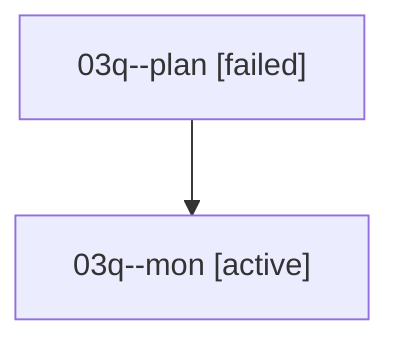

# Family: 03q

[Agent Hoods](../README.md) / [bbugyi200](../users/bbugyi200/README.md) / [athena](../users/bbugyi200/machines/athena/README.md) / [03q](../users/bbugyi200/machines/athena/hoods/03q/README.md) / 03q

Owner: `bbugyi200.athena` · Hood: `03q` · Members: 2

## Lineage

The diagram is an optional enhancement; the ordered table below contains the same lineage in accessible text.

| Role | Agent | State | Model / provider | Timing | Commits | Prompt | Chat |
|---|---|---|---|---|---:|---|---|
| plan | 03q--plan | failed | opus / claude | 2026-08-16T15:01:22.089723+00:00 | 0 | [Prompt](../agents/bbugyi200.athena.03q--plan/prompt.md) | [Chat](../agents/bbugyi200.athena.03q--plan/chat.md) |
| mon | 03q--mon | active | opus / claude | 2026-08-16T15:15:49.060559+00:00 | 0 | — | — |
