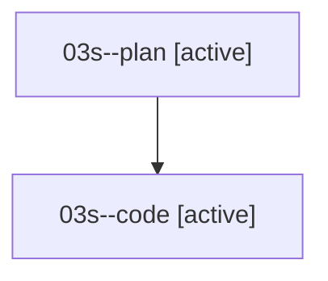

# Family: 03s

[Agent Hoods](../README.md) / [bbugyi200](../users/bbugyi200/README.md) / [athena](../users/bbugyi200/machines/athena/README.md) / [03s](../users/bbugyi200/machines/athena/hoods/03s/README.md) / 03s

Owner: `bbugyi200.athena` · Hood: `03s` · Members: 2

## Lineage

The diagram is an optional enhancement; the ordered table below contains the same lineage in accessible text.

| Role | Agent | State | Model / provider | Timing | Commits | Prompt | Chat |
|---|---|---|---|---|---:|---|---|
| plan | 03s--plan | active | gpt-5.6-sol / codex | 2026-08-16T15:09:56.297222+00:00 | 0 | [Prompt](../agents/bbugyi200.athena.03s--plan/prompt.md) | [Chat](../agents/bbugyi200.athena.03s--plan/chat.md) |
| code | 03s--code | active | sonnet / claude | 2026-08-16T15:15:09.258541+00:00 | [1](../agents/bbugyi200.athena.03s--code/README.md#commits) | — | — |

## Commits

| Role | Repo | Commit | Subject | Committed |
|---|---|---|---|---|
| code | sase | [`be0e35d`](https://github.com/sase-org/sase/commit/be0e35d8191c14db1154dda3e3dfdd61b8fe4700) | feat(ace): complete common words from the middle of a word | 2026-08-16 11:39:24 EDT |

## Neighbors

| Agent | Relation | State |
|---|---|---|
| [03s.w0](../agents/bbugyi200.athena.03s.w0/README.md) | descendant | waiting |
