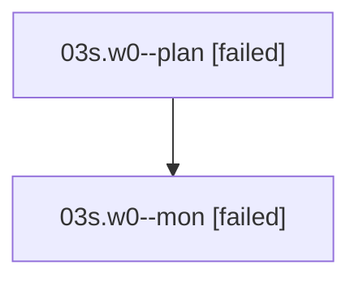

# Family: 03s.w0

[Agent Hoods](../README.md) / [bbugyi200](../users/bbugyi200/README.md) / [athena](../users/bbugyi200/machines/athena/README.md) / [03s](../users/bbugyi200/machines/athena/hoods/03s/README.md) / 03s.w0

Owner: `bbugyi200.athena` · Hood: `03s` · Members: 2

## Lineage

The diagram is an optional enhancement; the ordered table below contains the same lineage in accessible text.

| Role | Agent | State | Model / provider | Timing | Commits | Prompt | Chat |
|---|---|---|---|---|---:|---|---|
| plan | 03s.w0--plan | failed | opus / claude | 2026-08-16T15:59:59.965666+00:00 | 0 | [Prompt](../agents/bbugyi200.athena.03s.w0--plan/prompt.md) | [Chat](../agents/bbugyi200.athena.03s.w0--plan/chat.md) |
| mon | 03s.w0--mon | failed | opus / claude | 2026-08-16T16:13:31.905373+00:00 | 0 | — | [Chat](../agents/bbugyi200.athena.03s.w0--mon/chat.md) |

## Neighbors

| Agent | Relation | State |
|---|---|---|
| [03s](bbugyi200.athena.03s.md) (family · 2) | ancestor | active 1, dismissed 1 |
