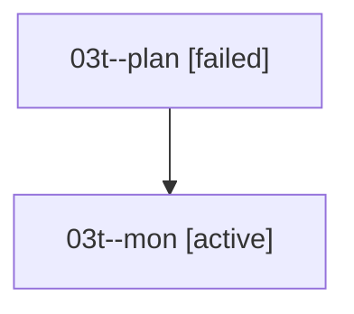

# Family: 03t

[Agent Hoods](../README.md) / [bbugyi200](../users/bbugyi200/README.md) / [athena](../users/bbugyi200/machines/athena/README.md) / [03t](../users/bbugyi200/machines/athena/hoods/03t/README.md) / 03t

Owner: `bbugyi200.athena` · Hood: `03t` · Members: 2

## Lineage

The diagram is an optional enhancement; the ordered table below contains the same lineage in accessible text.

| Role | Agent | State | Model / provider | Timing | Commits | Prompt | Chat |
|---|---|---|---|---|---:|---|---|
| plan | 03t--plan | failed | opus / claude | 2026-08-16T15:14:43.099949+00:00 | 0 | [Prompt](../agents/bbugyi200.athena.03t--plan/prompt.md) | [Chat](../agents/bbugyi200.athena.03t--plan/chat.md) |
| mon | 03t--mon | active | opus / claude | 2026-08-16T15:30:17.496146+00:00 | 0 | — | — |

## Commits

| Role | Repo | Commit | Subject | Committed |
|---|---|---|---|---|
| — | sase | [`69cf307`](https://github.com/sase-org/sase/commit/69cf307d15205dbd9cec27c3d3f402f47a8c525f) | chore: Add SDD prompt and plan for mark\_collapsed\_agent\_groups | 2026-06-23 06:04:06 EDT |
| — | sase | [`9a86edf`](https://github.com/sase-org/sase/commit/9a86edf1875ea0ed734cce2d114366baf5c69b4b) | feat(ace): mark collapsed agent groups | 2026-06-23 06:17:45 EDT |
