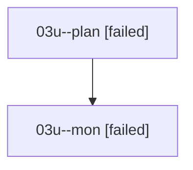

# Family: 03u

[Agent Hoods](../README.md) / [bbugyi200](../users/bbugyi200/README.md) / [athena](../users/bbugyi200/machines/athena/README.md) / [03u](../users/bbugyi200/machines/athena/hoods/03u/README.md) / 03u

Owner: `bbugyi200.athena` · Hood: `03u` · Members: 2

## Lineage

The diagram is an optional enhancement; the ordered table below contains the same lineage in accessible text.

| Role | Agent | State | Model / provider | Timing | Commits | Prompt | Chat |
|---|---|---|---|---|---:|---|---|
| plan | 03u--plan | failed | opus / claude | 2026-08-16T15:29:29.598419+00:00 | 0 | [Prompt](../agents/bbugyi200.athena.03u--plan/prompt.md) | [Chat](../agents/bbugyi200.athena.03u--plan/chat.md) |
| mon | 03u--mon | failed | opus / claude | 2026-08-16T15:59:32.019211+00:00 | 0 | — | [Chat](../agents/bbugyi200.athena.03u--mon/chat.md) |

## Commits

| Role | Repo | Commit | Subject | Committed |
|---|---|---|---|---|
| — | sase | [`bcbcc4c`](https://github.com/sase-org/sase/commit/bcbcc4ce98577611e29d92074afc9658a208245b) | chore: Add SDD prompt and plan for agy\_provider\_test\_isolation | 2026-06-23 06:53:05 EDT |
| — | sase | [`58ce374`](https://github.com/sase-org/sase/commit/58ce3745b447fd2fd1534ffc70ba311c53c8a90c) | test(agy): isolate command-construction test from workspace env vars | 2026-06-23 07:00:10 EDT |
