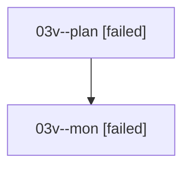

# Family: 03v

[Agent Hoods](../README.md) / [bbugyi200](../users/bbugyi200/README.md) / [athena](../users/bbugyi200/machines/athena/README.md) / [03v](../users/bbugyi200/machines/athena/hoods/03v/README.md) / 03v

Owner: `bbugyi200.athena` · Hood: `03v` · Members: 2

## Lineage

The diagram is an optional enhancement; the ordered table below contains the same lineage in accessible text.

| Role | Agent | State | Model / provider | Timing | Commits | Prompt | Chat |
|---|---|---|---|---|---:|---|---|
| plan | 03v--plan | failed | opus / claude | 2026-08-16T15:59:05.917161+00:00 | 0 | [Prompt](../agents/bbugyi200.athena.03v--plan/prompt.md) | [Chat](../agents/bbugyi200.athena.03v--plan/chat.md) |
| mon | 03v--mon | failed | opus / claude | 2026-08-16T16:18:47.942151+00:00 | 0 | — | [Chat](../agents/bbugyi200.athena.03v--mon/chat.md) |

## Commits

| Role | Repo | Commit | Subject | Committed |
|---|---|---|---|---|
| — | sase | [`89ba81f`](https://github.com/sase-org/sase/commit/89ba81f8c7b269e840021d9f0c7a97b294c129bd) | chore: Add SDD prompt and plan for quit\_confirm\_panel | 2026-06-23 06:54:50 EDT |
| — | sase | [`f472f51`](https://github.com/sase-org/sase/commit/f472f51ce0b2bf5933963b1992d84c62b96ee2ae) | feat(ace): show running tasks before quitting | 2026-06-23 07:12:04 EDT |
