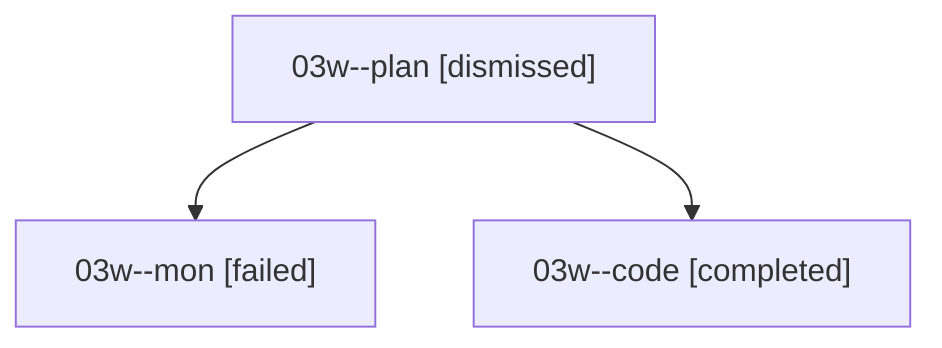

# Family: 03w

[Agent Hoods](../README.md) / [bbugyi200](../users/bbugyi200/README.md) / [athena](../users/bbugyi200/machines/athena/README.md) / [03w](../users/bbugyi200/machines/athena/hoods/03w/README.md) / 03w

Owner: `bbugyi200.athena` · Hood: `03w` · Members: 3

## Lineage

The diagram is an optional enhancement; the ordered table below contains the same lineage in accessible text.

| Role | Agent | State | Model / provider | Timing | Commits | Prompt | Chat |
|---|---|---|---|---|---:|---|---|
| plan | 03w--plan | dismissed | — | 2026-08-16T12:11:20 | 0 | — | — |
| mon | 03w--mon | failed | grok-4.6 / grok | 2026-08-16T17:07:57.829883+00:00 | 0 | — | [Chat](../agents/bbugyi200.athena.03w--mon/chat.md) |
| code | 03w--code | completed | grok-4.6 / grok | 2026-08-16T16:20:59.107449+00:00 | 0 | — | [Chat](../agents/bbugyi200.athena.03w--code/chat.md) |

## Commits

| Role | Repo | Commit | Subject | Committed |
|---|---|---|---|---|
| — | sase | [`2c3e7fb`](https://github.com/sase-org/sase/commit/2c3e7fbfd71599fe48e9fa92dac9a0a1991cc203) | chore: Add SDD prompt and plan for agent\_restore\_delete\_saved\_group | 2026-06-23 07:14:23 EDT |
| — | sase | [`4a47da3`](https://github.com/sase-org/sase/commit/4a47da3358291c0f9f9f0b114679a6a6a77b7a36) | feat(ace): delete saved groups from restore panel | 2026-06-23 07:33:49 EDT |
