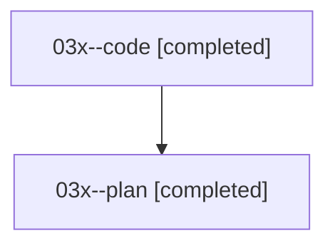

# Family: 03x

[Agent Hoods](../README.md) / [bbugyi200](../users/bbugyi200/README.md) / [athena](../users/bbugyi200/machines/athena/README.md) / [03x](../users/bbugyi200/machines/athena/hoods/03x/README.md) / 03x

Owner: `bbugyi200.athena` · Hood: `03x` · Members: 2

## Lineage

The diagram is an optional enhancement; the ordered table below contains the same lineage in accessible text.

| Role | Agent | State | Model / provider | Timing | Commits | Prompt | Chat |
|---|---|---|---|---|---:|---|---|
| code | 03x--code | completed | sonnet / claude | 2026-08-16T16:53:04.326541+00:00 | [1](../agents/bbugyi200.athena.03x--code/README.md#commits) | — | [Chat](../agents/bbugyi200.athena.03x--code/chat.md) |
| plan | 03x--plan | completed | opus / claude | 2026-08-16T16:35:45.529479+00:00 | 0 | [Prompt](../agents/bbugyi200.athena.03x--plan/prompt.md) | [Chat](../agents/bbugyi200.athena.03x--plan/chat.md) |

## Commits

| Role | Repo | Commit | Subject | Committed |
|---|---|---|---|---|
| — | sase | [`353e536`](https://github.com/sase-org/sase/commit/353e536c0b2e30cd657700c5814c0efe9e97cf71) | chore: Add SDD prompt and plan for rust\_clippy\_196\_fix | 2026-06-23 11:20:06 UTC |
| — | sase | [`ec78b05`](https://github.com/sase-org/sase/commit/ec78b0539195e876ad2ce2f9b7c003b7c6dd5f0f) | chore: Mark SDD plan done | 2026-06-23 12:38:26 UTC |
| code | sase | [`ce1ad41`](https://github.com/sase-org/sase/commit/ce1ad41a1c874bca1d05158477a80ab8d8a612c9) | fix(ace): stop the file panel from losing the reader's scroll position | 2026-08-16 17:54:02 UTC |
