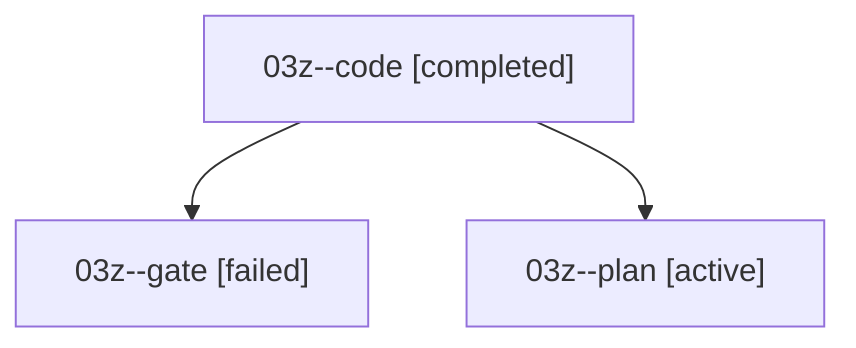

# Family: 03z

[Agent Hoods](../README.md) / [bbugyi200](../users/bbugyi200/README.md) / [athena](../users/bbugyi200/machines/athena/README.md) / [03z](../users/bbugyi200/machines/athena/hoods/03z/README.md) / 03z

Owner: `bbugyi200.athena` · Hood: `03z` · Members: 3

## Lineage

The diagram is an optional enhancement; the ordered table below contains the same lineage in accessible text.

| Role | Agent | State | Model / provider | Timing | Commits | Prompt | Chat |
|---|---|---|---|---|---:|---|---|
| code | 03z--code | completed | gpt-5.5 / codex | 2026-09-07T18:27:18.090241+00:00 → 2026-09-07T19:23:26.469212+00:00 | [1](../agents/bbugyi200.athena.03z--code/README.md#commits) | [Prompt](../agents/bbugyi200.athena.03z--code/prompt.md) | [Chat](../agents/bbugyi200.athena.03z--code/chat.md) |
| gate | 03z--gate | failed | claude-fable-5 / claude | 2026-09-07T18:25:23.737124+00:00 → 2026-09-07T18:27:10.457172+00:00 | 0 | — | [Chat](../agents/bbugyi200.athena.03z--gate/chat.md) |
| plan | 03z--plan | active | claude-fable-5 / claude | 2026-09-07T18:11:55.784929+00:00 | 0 | [Prompt](../agents/bbugyi200.athena.03z--plan/prompt.md) | [Chat](../agents/bbugyi200.athena.03z--plan/chat.md) |

## Commits

| Role | Repo | Commit | Subject | Committed |
|---|---|---|---|---|
| — | sase | [`25dd797`](https://github.com/sase-org/sase/commit/25dd79799f05564316551c3b6820aa3543502a1a) | chore: Add SDD prompt and plan for zoom\_file\_panel\_blank\_until\_refresh | 2026-06-23 08:07:02 EDT |
| — | sase | [`0a45157`](https://github.com/sase-org/sase/commit/0a45157381f84336fa2cc570e802614b645356d5) | fix(ace): render seeded zoom file panels | 2026-06-23 08:19:20 EDT |
| code | sase | [`a1d88a8`](https://github.com/sase-org/sase/commit/a1d88a861ee0c52c553d11c348967f6b1b8a15a1) | fix(gate-shell): protect finalizer workspace claims | 2026-09-07 15:21:56 EDT |

## Neighbors

| Agent | Relation | State |
|---|---|---|
| [03z.f1](../agents/bbugyi200.athena.03z.f1/README.md) | descendant | completed |
