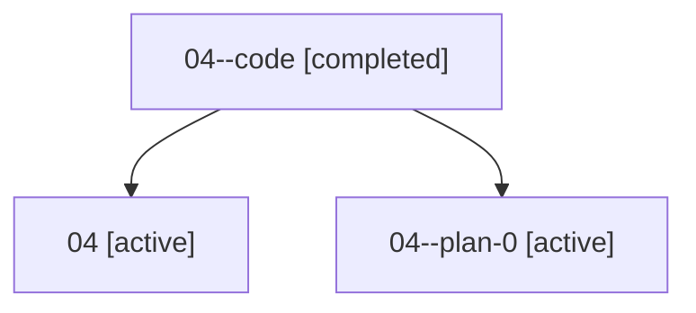

# Family: 04

Owner: `bbugyi200.athena` · Hood: `04` · Members: 3

## Lineage

The diagram is an optional enhancement; the ordered table below contains the same lineage in accessible text.

| Role | Agent | State | Model / provider | Timing | Commits | Prompt | Chat |
|---|---|---|---|---|---:|---|---|
| code | 04--code | completed | gpt-5.5 / codex | 2026-07-07T04:00:08.065026+00:00 | 0 | — | [Chat](../agents/bbugyi200.athena.04--code/chat.md) |
| root | 04 | active | claude-fable-5 / claude | 2026-07-07T03:21:12.554439+00:00 | 4 | [Prompt](../agents/bbugyi200.athena.04/prompt.md) | [Chat](../agents/bbugyi200.athena.04/chat.md) |
| plan-0 | 04--plan-0 | active | claude-fable-5 / claude | 2026-07-07T03:41:15.922828+00:00 | 0 | — | [Chat](../agents/bbugyi200.athena.04--plan-0/chat.md) |
