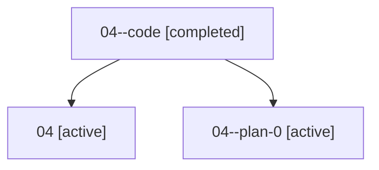

# Family: 04

[Agent Hoods](../README.md) / [bbugyi200](../users/bbugyi200/README.md) / [athena](../users/bbugyi200/machines/athena/README.md) / [04](../users/bbugyi200/machines/athena/hoods/04/README.md) / 04

Owner: `bbugyi200.athena` · Hood: `04` · Members: 3

## Lineage

The diagram is an optional enhancement; the ordered table below contains the same lineage in accessible text.

| Role | Agent | State | Model / provider | Timing | Commits | Prompt | Chat |
|---|---|---|---|---|---:|---|---|
| code | 04--code | completed | gpt-5.5 / codex | 2026-07-07T04:00:08.065026+00:00 | [1](../agents/bbugyi200.athena.04--code/README.md#commits) | — | [Chat](../agents/bbugyi200.athena.04--code/chat.md) |
| root | 04 | active | claude-fable-5 / claude | 2026-07-07T03:21:12.554439+00:00 | 0 | [Prompt](../agents/bbugyi200.athena.04/prompt.md) | [Chat](../agents/bbugyi200.athena.04/chat.md) |
| plan-0 | 04--plan-0 | active | claude-fable-5 / claude | 2026-07-07T03:41:15.922828+00:00 | [1](../agents/bbugyi200.athena.04--plan-0/README.md#commits) | — | [Chat](../agents/bbugyi200.athena.04--plan-0/chat.md) |

## Commits

| Role | Repo | Commit | Subject | Committed |
|---|---|---|---|---|
| — | sase | [`5bbe080`](https://github.com/sase-org/sase/commit/5bbe080279d4f202903175d4ab341bee756826f0) | chore: Add SDD prompt and plan for mode\_switch\_github\_dev\_root | 2026-07-05 10:21:28 UTC |
| — | sase | [`672c3ce`](https://github.com/sase-org/sase/commit/672c3cea88582de76508080ff5a1639201a0efea) | feat(mode-switch)!: use GitHub dev checkout layout | 2026-07-05 10:43:21 UTC |
| plan-0 | sase | [`3717d87`](https://github.com/sase-org/sase/commit/3717d87a6d4ad7eb0f13ceeb3afdc2c2da937877) | chore: Add SDD prompt and plan for sase\_run\_literal\_directive\_fix | 2026-07-07 04:00:06 UTC |
| code | sase | [`a7953c4`](https://github.com/sase-org/sase/commit/a7953c42dd1d35c94f8a032d6cc2b9e7c8354a7d) | docs(skills): document literal prompt directives | 2026-07-07 04:51:11 UTC |
