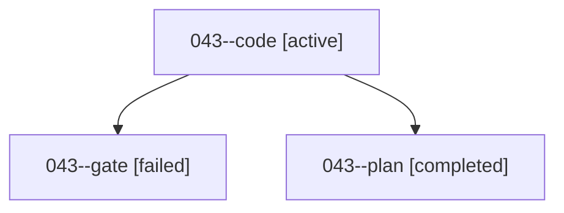

# Family: 043

[Agent Hoods](../README.md) / [bbugyi200](../users/bbugyi200/README.md) / [athena](../users/bbugyi200/machines/athena/README.md) / [043](../users/bbugyi200/machines/athena/hoods/043/README.md) / 043

Owner: `bbugyi200.athena` · Hood: `043` · Members: 3

## Lineage

The diagram is an optional enhancement; the ordered table below contains the same lineage in accessible text.

| Role | Agent | State | Model / provider | Timing | Commits | Prompt | Chat |
|---|---|---|---|---|---:|---|---|
| code | 043--code | active | sonnet / claude | 2026-09-07T18:43:59.062250+00:00 | [1](../agents/bbugyi200.athena.043--code/README.md#commits) | [Prompt](../agents/bbugyi200.athena.043--code/prompt.md) | — |
| gate | 043--gate | failed | opus / claude | 2026-09-07T18:39:15.965773+00:00 → 2026-09-07T18:43:52.976139+00:00 | 0 | — | [Chat](../agents/bbugyi200.athena.043--gate/chat.md) |
| plan | 043--plan | completed | opus / claude | 2026-09-07T18:30:15.287409+00:00 → 2026-09-07T18:39:25.167962+00:00 | 0 | [Prompt](../agents/bbugyi200.athena.043--plan/prompt.md) | [Chat](../agents/bbugyi200.athena.043--plan/chat.md) |

## Commits

| Role | Repo | Commit | Subject | Committed |
|---|---|---|---|---|
| — | sase | [`4ccfa21`](https://github.com/sase-org/sase/commit/4ccfa212d6aa54d9021080485f6460291cfed343) | chore: Add SDD prompt and plan for xprompts\_enabled\_skips\_early\_jinja\_render | 2026-06-23 08:37:42 EDT |
| — | sase | [`3be2894`](https://github.com/sase-org/sase/commit/3be2894bd0cdcf935c6b60fd63b8cc99089f9a8f) | fix: preserve disabled regions during early Jinja render | 2026-06-23 08:44:06 EDT |
| code | sase | [`df86d7e`](https://github.com/sase-org/sase/commit/df86d7e5d3af9e57c39f8865b3abf61d08bb63c6) | feat(agents-panel): add all-panel fold sweep bound to \`\_\` | 2026-09-07 15:59:04 EDT |
