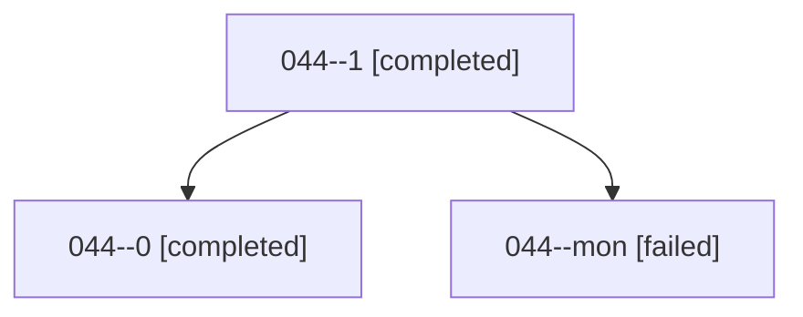

# Family: 044

[Agent Hoods](../README.md) / [bbugyi200](../users/bbugyi200/README.md) / [athena](../users/bbugyi200/machines/athena/README.md) / [044](../users/bbugyi200/machines/athena/hoods/044/README.md) / 044

Owner: `bbugyi200.athena` · Hood: `044` · Members: 3

## Lineage

The diagram is an optional enhancement; the ordered table below contains the same lineage in accessible text.

| Role | Agent | State | Model / provider | Timing | Commits | Prompt | Chat |
|---|---|---|---|---|---:|---|---|
| 1 | 044--1 | completed | gpt-5.6-sol / codex | 2026-08-16T18:20:58.743525+00:00 | 0 | [Prompt](../agents/bbugyi200.athena.044--1/prompt.md) | [Chat](../agents/bbugyi200.athena.044--1/chat.md) |
| 0 | 044--0 | completed | gpt-5.6-sol / codex | 2026-08-16T17:43:39.520604+00:00 | [1](../agents/bbugyi200.athena.044--0/README.md#commits) | [Prompt](../agents/bbugyi200.athena.044--0/prompt.md) | [Chat](../agents/bbugyi200.athena.044--0/chat.md) |
| mon | 044--mon | failed | gpt-5.6-sol / codex | 2026-08-16T18:18:22.135550+00:00 | 0 | — | [Chat](../agents/bbugyi200.athena.044--mon/chat.md) |

## Commits

| Role | Repo | Commit | Subject | Committed |
|---|---|---|---|---|
| 0 | sase | [`71061ce`](https://github.com/sase-org/sase/commit/71061ceada7d4153bead25d4d12a0fe8820ef2ea) | fix(monitor): publish supervisor pid before startup ack | 2026-08-16 14:16:01 EDT |
