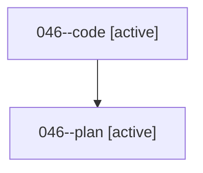

# Family: 046

[Agent Hoods](../README.md) / [bbugyi200](../users/bbugyi200/README.md) / [athena](../users/bbugyi200/machines/athena/README.md) / [046](../users/bbugyi200/machines/athena/hoods/046/README.md) / 046

Owner: `bbugyi200.athena` · Hood: `046` · Members: 2

## Lineage

The diagram is an optional enhancement; the ordered table below contains the same lineage in accessible text.

| Role | Agent | State | Model / provider | Timing | Commits | Prompt | Chat |
|---|---|---|---|---|---:|---|---|
| code | 046--code | active | gpt-5.5 / codex | 2026-08-16T19:17:33.609079+00:00 | 0 | — | — |
| plan | 046--plan | active | gpt-5.6-sol / codex | 2026-08-16T19:04:22.442955+00:00 | 0 | [Prompt](../agents/bbugyi200.athena.046--plan/prompt.md) | [Chat](../agents/bbugyi200.athena.046--plan/chat.md) |

## Commits

| Role | Repo | Commit | Subject | Committed |
|---|---|---|---|---|
| — | sase | [`83c5cff`](https://github.com/sase-org/sase/commit/83c5cffa972c63e8f7437a72de303cef090eaf68) | chore: Add SDD prompt and plan for remove\_model\_directive\_multi\_arg | 2026-06-23 09:18:49 EDT |
| — | sase | [`231792b`](https://github.com/sase-org/sase/commit/231792b322bf5bcc3ac0c63571a452d3893c5e4b) | feat!: reject legacy multi-model directives | 2026-06-23 09:44:56 EDT |

## Neighbors

| Agent | Relation | State |
|---|---|---|
| [046.f1.cld](../agents/bbugyi200.athena.046.f1.cld/README.md) | descendant | completed |
