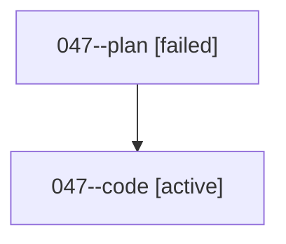

# Family: 047

[Agent Hoods](../README.md) / [bbugyi200](../users/bbugyi200/README.md) / [athena](../users/bbugyi200/machines/athena/README.md) / [047](../users/bbugyi200/machines/athena/hoods/047/README.md) / 047

Owner: `bbugyi200.athena` · Hood: `047` · Members: 2

## Lineage

The diagram is an optional enhancement; the ordered table below contains the same lineage in accessible text.

| Role | Agent | State | Model / provider | Timing | Commits | Prompt | Chat |
|---|---|---|---|---|---:|---|---|
| plan | 047--plan | failed | opus / claude | 2026-08-16T19:48:44.730537+00:00 | 0 | [Prompt](../agents/bbugyi200.athena.047--plan/prompt.md) | [Chat](../agents/bbugyi200.athena.047--plan/chat.md) |
| code | 047--code | active | gpt-5.5 / codex | 2026-08-16T19:55:26.025318+00:00 | [1](../agents/bbugyi200.athena.047--code/README.md#commits) | — | — |

## Commits

| Role | Repo | Commit | Subject | Committed |
|---|---|---|---|---|
| code | sase | [`26c9f9a`](https://github.com/sase-org/sase/commit/26c9f9a924f701f86b3cb2ddba99e0986d65ac7e) | docs: define sase monitor glossary term | 2026-08-16 16:10:59 EDT |
