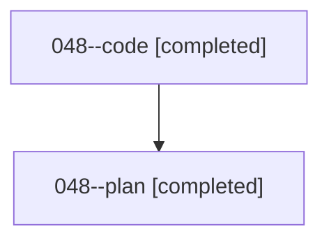

# Family: 048

[Agent Hoods](../README.md) / [bbugyi200](../users/bbugyi200/README.md) / [athena](../users/bbugyi200/machines/athena/README.md) / [048](../users/bbugyi200/machines/athena/hoods/048/README.md) / 048

Owner: `bbugyi200.athena` · Hood: `048` · Members: 2

## Lineage

The diagram is an optional enhancement; the ordered table below contains the same lineage in accessible text.

| Role | Agent | State | Model / provider | Timing | Commits | Prompt | Chat |
|---|---|---|---|---|---:|---|---|
| code | 048--code | completed | sonnet / claude | 2026-08-16T20:05:04.865383+00:00 | [1](../agents/bbugyi200.athena.048--code/README.md#commits) | — | [Chat](../agents/bbugyi200.athena.048--code/chat.md) |
| plan | 048--plan | completed | opus / claude | 2026-08-16T19:52:34.668600+00:00 | 0 | [Prompt](../agents/bbugyi200.athena.048--plan/prompt.md) | [Chat](../agents/bbugyi200.athena.048--plan/chat.md) |

## Commits

| Role | Repo | Commit | Subject | Committed |
|---|---|---|---|---|
| — | sase | [`70d4214`](https://github.com/sase-org/sase/commit/70d4214cfa1c98c850ee55ad0c303a81435f2159) | chore: Add SDD prompt and plan for zoom\_file\_reverse\_cycle | 2026-06-23 13:02:11 UTC |
| — | sase | [`229050d`](https://github.com/sase-org/sase/commit/229050d10b4446af76af8d887b58e822d4e286f7) | test(ace): cover zoom modal file cycling in both directions | 2026-06-23 13:18:51 UTC |
| code | sase | [`83e2cee`](https://github.com/sase-org/sase/commit/83e2ceea6a47e3234d58a2a206a3be2f32eb8fb1) | feat(ace): unify monitor gear iconography across nodes and the top bar | 2026-08-16 21:15:13 UTC |
