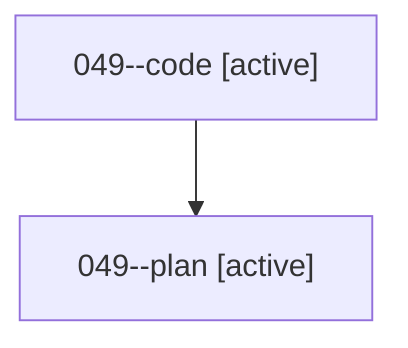

# Family: 049

[Agent Hoods](../README.md) / [bbugyi200](../users/bbugyi200/README.md) / [athena](../users/bbugyi200/machines/athena/README.md) / [049](../users/bbugyi200/machines/athena/hoods/049/README.md) / 049

Owner: `bbugyi200.athena` · Hood: `049` · Members: 2

## Lineage

The diagram is an optional enhancement; the ordered table below contains the same lineage in accessible text.

| Role | Agent | State | Model / provider | Timing | Commits | Prompt | Chat |
|---|---|---|---|---|---:|---|---|
| code | 049--code | active | gpt-5.5 / codex | 2026-08-16T20:07:54.180910+00:00 | 0 | — | — |
| plan | 049--plan | active | opus / claude | 2026-08-16T19:55:08.057233+00:00 | 0 | [Prompt](../agents/bbugyi200.athena.049--plan/prompt.md) | [Chat](../agents/bbugyi200.athena.049--plan/chat.md) |

## Commits

| Role | Repo | Commit | Subject | Committed |
|---|---|---|---|---|
| — | sase | [`d941409`](https://github.com/sase-org/sase/commit/d941409de4307f4bafc2964fd8c07fdecd3410dd) | chore: Add SDD prompt and plan for disable\_prompt\_keymap\_leak | 2026-06-23 09:47:41 EDT |
