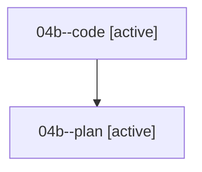

# Family: 04b

[Agent Hoods](../README.md) / [bbugyi200](../users/bbugyi200/README.md) / [athena](../users/bbugyi200/machines/athena/README.md) / [04b](../users/bbugyi200/machines/athena/hoods/04b/README.md) / 04b

Owner: `bbugyi200.athena` · Hood: `04b` · Members: 2

## Lineage

The diagram is an optional enhancement; the ordered table below contains the same lineage in accessible text.

| Role | Agent | State | Model / provider | Timing | Commits | Prompt | Chat |
|---|---|---|---|---|---:|---|---|
| code | 04b--code | active | sonnet / claude | 2026-08-16T20:42:18.509423+00:00 | 0 | — | — |
| plan | 04b--plan | active | opus / claude | 2026-08-16T20:14:23.970089+00:00 | 0 | [Prompt](../agents/bbugyi200.athena.04b--plan/prompt.md) | [Chat](../agents/bbugyi200.athena.04b--plan/chat.md) |
