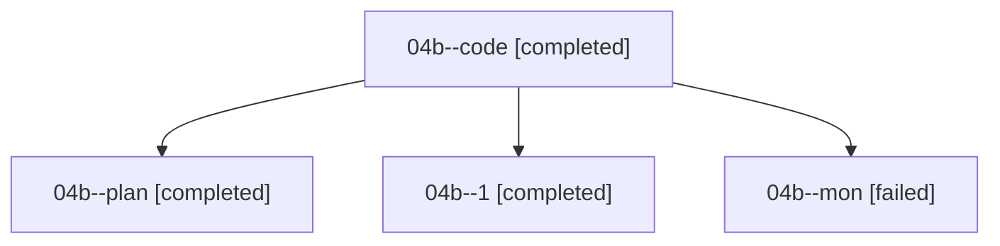

# Family: 04b

[Agent Hoods](../README.md) / [bbugyi200](../users/bbugyi200/README.md) / [athena](../users/bbugyi200/machines/athena/README.md) / [04b](../users/bbugyi200/machines/athena/hoods/04b/README.md) / 04b

Owner: `bbugyi200.athena` · Hood: `04b` · Members: 4

## Lineage

The diagram is an optional enhancement; the ordered table below contains the same lineage in accessible text.

| Role | Agent | State | Model / provider | Timing | Commits | Prompt | Chat |
|---|---|---|---|---|---:|---|---|
| code | 04b--code | completed | sonnet / claude | 2026-08-16T20:42:18.509423+00:00 | 0 | — | [Chat](../agents/bbugyi200.athena.04b--code/chat.md) |
| plan | 04b--plan | completed | opus / claude | 2026-08-16T20:14:23.970089+00:00 | 0 | [Prompt](../agents/bbugyi200.athena.04b--plan/prompt.md) | [Chat](../agents/bbugyi200.athena.04b--plan/chat.md) |
| 1 | 04b--1 | completed | sonnet / claude | 2026-08-16T21:19:50.777502+00:00 | [1](../agents/bbugyi200.athena.04b--1/README.md#commits) | [Prompt](../agents/bbugyi200.athena.04b--1/prompt.md) | [Chat](../agents/bbugyi200.athena.04b--1/chat.md) |
| mon | 04b--mon | failed | sonnet / claude | 2026-08-16T21:17:46.605835+00:00 | 0 | — | [Chat](../agents/bbugyi200.athena.04b--mon/chat.md) |

## Commits

| Role | Repo | Commit | Subject | Committed |
|---|---|---|---|---|
| 1 | sase | [`35d75b2`](https://github.com/sase-org/sase/commit/35d75b24e9e76b85f8952df8bf21dbc77bd7be3a) | fix(bead): stop commit finalizer failing runs over staged bead state | 2026-08-16 21:20:46 UTC |
