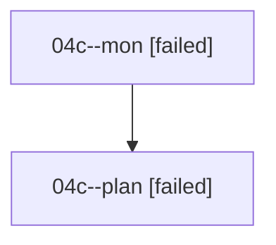

# Family: 04c

[Agent Hoods](../README.md) / [bbugyi200](../users/bbugyi200/README.md) / [athena](../users/bbugyi200/machines/athena/README.md) / [04c](../users/bbugyi200/machines/athena/hoods/04c/README.md) / 04c

Owner: `bbugyi200.athena` · Hood: `04c` · Members: 2

## Lineage

The diagram is an optional enhancement; the ordered table below contains the same lineage in accessible text.

| Role | Agent | State | Model / provider | Timing | Commits | Prompt | Chat |
|---|---|---|---|---|---:|---|---|
| mon | 04c--mon | failed | opus / claude | 2026-08-16T21:11:04.787918+00:00 | 0 | — | [Chat](../agents/bbugyi200.athena.04c--mon/chat.md) |
| plan | 04c--plan | failed | opus / claude | 2026-08-16T20:40:46.310754+00:00 | 0 | [Prompt](../agents/bbugyi200.athena.04c--plan/prompt.md) | [Chat](../agents/bbugyi200.athena.04c--plan/chat.md) |

## Commits

| Role | Repo | Commit | Subject | Committed |
|---|---|---|---|---|
| — | sase | [`dcf015e`](https://github.com/sase-org/sase/commit/dcf015e022e1a4744c64ee606697dcebf60efc05) | ci: add publish workflow concurrency | 2026-06-23 10:30:30 EDT |
