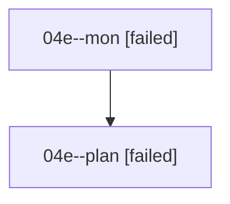

# Family: 04e

[Agent Hoods](../README.md) / [bbugyi200](../users/bbugyi200/README.md) / [athena](../users/bbugyi200/machines/athena/README.md) / [04e](../users/bbugyi200/machines/athena/hoods/04e/README.md) / 04e

Owner: `bbugyi200.athena` · Hood: `04e` · Members: 2

## Lineage

The diagram is an optional enhancement; the ordered table below contains the same lineage in accessible text.

| Role | Agent | State | Model / provider | Timing | Commits | Prompt | Chat |
|---|---|---|---|---|---:|---|---|
| mon | 04e--mon | failed | opus / claude | 2026-08-17T10:01:47.910371+00:00 | 0 | — | [Chat](../agents/bbugyi200.athena.04e--mon/chat.md) |
| plan | 04e--plan | failed | opus / claude | 2026-08-17T09:51:02.954518+00:00 | 0 | [Prompt](../agents/bbugyi200.athena.04e--plan/prompt.md) | [Chat](../agents/bbugyi200.athena.04e--plan/chat.md) |
