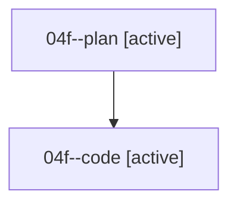

# Family: 04f

[Agent Hoods](../README.md) / [bbugyi200](../users/bbugyi200/README.md) / [athena](../users/bbugyi200/machines/athena/README.md) / [04f](../users/bbugyi200/machines/athena/hoods/04f/README.md) / 04f

Owner: `bbugyi200.athena` · Hood: `04f` · Members: 2

## Lineage

The diagram is an optional enhancement; the ordered table below contains the same lineage in accessible text.

| Role | Agent | State | Model / provider | Timing | Commits | Prompt | Chat |
|---|---|---|---|---|---:|---|---|
| plan | 04f--plan | active | opus / claude | 2026-08-17T10:22:20.939359+00:00 | 0 | [Prompt](../agents/bbugyi200.athena.04f--plan/prompt.md) | [Chat](../agents/bbugyi200.athena.04f--plan/chat.md) |
| code | 04f--code | active | sonnet / claude | 2026-08-17T10:40:22.687320+00:00 | [1](../agents/bbugyi200.athena.04f--code/README.md#commits) | — | — |

## Commits

| Role | Repo | Commit | Subject | Committed |
|---|---|---|---|---|
| code | sase | [`92934cb`](https://github.com/sase-org/sase/commit/92934cb04c9b9817151106360a953f4faa82ed96) | fix(llm-provider): honor absolute provider reset timestamps in usage-limit disables | 2026-08-17 07:06:05 EDT |

## Neighbors

| Agent | Relation | State |
|---|---|---|
| [04f.cld](../agents/bbugyi200.athena.04f.cld/README.md) | descendant | completed |
