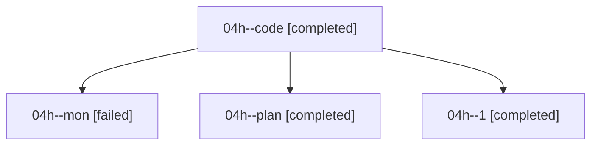

# Family: 04h

[Agent Hoods](../README.md) / [bbugyi200](../users/bbugyi200/README.md) / [athena](../users/bbugyi200/machines/athena/README.md) / [04h](../users/bbugyi200/machines/athena/hoods/04h/README.md) / 04h

Owner: `bbugyi200.athena` · Hood: `04h` · Members: 4

## Lineage

The diagram is an optional enhancement; the ordered table below contains the same lineage in accessible text.

| Role | Agent | State | Model / provider | Timing | Commits | Prompt | Chat |
|---|---|---|---|---|---:|---|---|
| code | 04h--code | completed | grok-4.6 / grok | 2026-08-17T10:55:02.035429+00:00 | 0 | — | [Chat](../agents/bbugyi200.athena.04h--code/chat.md) |
| mon | 04h--mon | failed | grok-4.6 / grok | 2026-08-17T11:44:44.326212+00:00 | 0 | — | [Chat](../agents/bbugyi200.athena.04h--mon/chat.md) |
| plan | 04h--plan | completed | opus / claude | 2026-08-17T10:42:09.609675+00:00 | 0 | [Prompt](../agents/bbugyi200.athena.04h--plan/prompt.md) | [Chat](../agents/bbugyi200.athena.04h--plan/chat.md) |
| 1 | 04h--1 | completed | grok-4.6 / grok | 2026-08-17T12:30:02.001500+00:00 | 0 | [Prompt](../agents/bbugyi200.athena.04h--1/prompt.md) | [Chat](../agents/bbugyi200.athena.04h--1/chat.md) |

## Commits

| Role | Repo | Commit | Subject | Committed |
|---|---|---|---|---|
| — | sase | [`b8d26eb`](https://github.com/sase-org/sase/commit/b8d26eb035a7d9ff8bc2e2d108ab1ad88b9c9b5c) | feat(ace-tui): collapse the artifacts relations rail with \`.\` | 2026-08-17 08:58:01 EDT |
