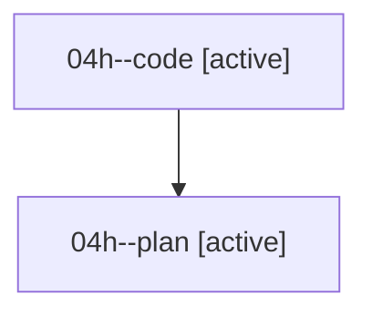

# Family: 04h

[Agent Hoods](../README.md) / [bbugyi200](../users/bbugyi200/README.md) / [athena](../users/bbugyi200/machines/athena/README.md) / [04h](../users/bbugyi200/machines/athena/hoods/04h/README.md) / 04h

Owner: `bbugyi200.athena` · Hood: `04h` · Members: 2

## Lineage

The diagram is an optional enhancement; the ordered table below contains the same lineage in accessible text.

| Role | Agent | State | Model / provider | Timing | Commits | Prompt | Chat |
|---|---|---|---|---|---:|---|---|
| code | 04h--code | active | grok-4.6 / grok | 2026-08-17T10:55:02.035429+00:00 | 0 | — | — |
| plan | 04h--plan | active | opus / claude | 2026-08-17T10:42:09.609675+00:00 | 0 | [Prompt](../agents/bbugyi200.athena.04h--plan/prompt.md) | [Chat](../agents/bbugyi200.athena.04h--plan/chat.md) |
