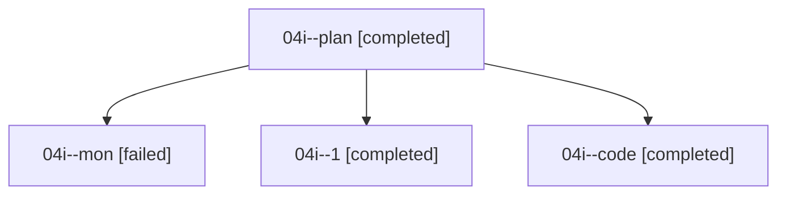

# Family: 04i

[Agent Hoods](../README.md) / [bbugyi200](../users/bbugyi200/README.md) / [athena](../users/bbugyi200/machines/athena/README.md) / [04i](../users/bbugyi200/machines/athena/hoods/04i/README.md) / 04i

Owner: `bbugyi200.athena` · Hood: `04i` · Members: 4

## Lineage

The diagram is an optional enhancement; the ordered table below contains the same lineage in accessible text.

| Role | Agent | State | Model / provider | Timing | Commits | Prompt | Chat |
|---|---|---|---|---|---:|---|---|
| plan | 04i--plan | completed | opus / claude | 2026-08-17T10:47:17.887788+00:00 | 0 | [Prompt](../agents/bbugyi200.athena.04i--plan/prompt.md) | [Chat](../agents/bbugyi200.athena.04i--plan/chat.md) |
| mon | 04i--mon | failed | sonnet / claude | 2026-08-17T11:24:38.808621+00:00 | 0 | — | [Chat](../agents/bbugyi200.athena.04i--mon/chat.md) |
| 1 | 04i--1 | completed | sonnet / claude | 2026-08-17T11:26:40.489563+00:00 | [1](../agents/bbugyi200.athena.04i--1/README.md#commits) | [Prompt](../agents/bbugyi200.athena.04i--1/prompt.md) | [Chat](../agents/bbugyi200.athena.04i--1/chat.md) |
| code | 04i--code | completed | sonnet / claude | 2026-08-17T10:59:55.924707+00:00 | 0 | — | [Chat](../agents/bbugyi200.athena.04i--code/chat.md) |

## Commits

| Role | Repo | Commit | Subject | Committed |
|---|---|---|---|---|
| — | sase | [`dc22c41`](https://github.com/sase-org/sase/commit/dc22c41118edcd0f0aeb226e1802092d8eaa9fe3) | chore: Add SDD prompt and plan for fix\_flaky\_input\_modal\_error\_snapshot | 2026-06-23 12:26:38 EDT |
| — | sase | [`ca3c15b`](https://github.com/sase-org/sase/commit/ca3c15bf67d297377db9a228b5d5b550f28c75e0) | test: stabilize input modal error snapshot | 2026-06-23 12:35:47 EDT |
| 1 | sase | [`5be0268`](https://github.com/sase-org/sase/commit/5be0268643a4bba0c1136d6dc49711388013b59e) | feat(ace-tui): add g/G top/bottom jumps to notifications detail pane | 2026-08-17 07:27:39 EDT |
