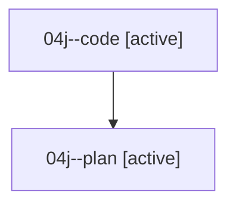

# Family: 04j

[Agent Hoods](../README.md) / [bbugyi200](../users/bbugyi200/README.md) / [athena](../users/bbugyi200/machines/athena/README.md) / [04j](../users/bbugyi200/machines/athena/hoods/04j/README.md) / 04j

Owner: `bbugyi200.athena` · Hood: `04j` · Members: 2

## Lineage

The diagram is an optional enhancement; the ordered table below contains the same lineage in accessible text.

| Role | Agent | State | Model / provider | Timing | Commits | Prompt | Chat |
|---|---|---|---|---|---:|---|---|
| code | 04j--code | active | grok-4.6 / grok | 2026-08-17T11:33:12.857202+00:00 | 0 | — | — |
| plan | 04j--plan | active | opus / claude | 2026-08-17T11:14:37.800124+00:00 | 0 | [Prompt](../agents/bbugyi200.athena.04j--plan/prompt.md) | [Chat](../agents/bbugyi200.athena.04j--plan/chat.md) |

## Commits

| Role | Repo | Commit | Subject | Committed |
|---|---|---|---|---|
| — | sase | [`ee82c7c`](https://github.com/sase-org/sase/commit/ee82c7c62675f73dd2751d22fee8fc3edc951629) | chore: Add SDD prompt and plan for linked\_repo\_deltas\_rust\_scan\_fix | 2026-06-23 12:46:59 EDT |
| — | sase | [`a152741`](https://github.com/sase-org/sase/commit/a1527417768cf5a51bf4099e6e1e3c0c7294e1e7) | fix(agent-scan): rebuild stale linked repo index rows | 2026-06-23 13:03:55 EDT |

## Neighbors

| Agent | Relation | State |
|---|---|---|
| [04j.f1](../agents/bbugyi200.athena.04j.f1/README.md) | descendant | completed |
| [04j.f1.f1](../agents/bbugyi200.athena.04j.f1.f1/README.md) | descendant | completed |
| [04j.f1.f1.f1](../agents/bbugyi200.athena.04j.f1.f1.f1/README.md) | descendant | completed |
