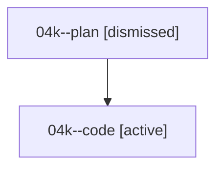

# Family: 04k

[Agent Hoods](../README.md) / [bbugyi200](../users/bbugyi200/README.md) / [athena](../users/bbugyi200/machines/athena/README.md) / [04k](../users/bbugyi200/machines/athena/hoods/04k/README.md) / 04k

Owner: `bbugyi200.athena` · Hood: `04k` · Members: 2

## Lineage

The diagram is an optional enhancement; the ordered table below contains the same lineage in accessible text.

| Role | Agent | State | Model / provider | Timing | Commits | Prompt | Chat |
|---|---|---|---|---|---:|---|---|
| plan | 04k--plan | dismissed | — | 2026-08-17T07:21:38 | 0 | — | — |
| code | 04k--code | active | sonnet / claude | 2026-08-17T11:44:43.056045+00:00 | 0 | — | — |
