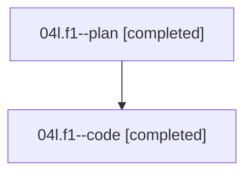

# Family: 04l.f1

[Agent Hoods](../README.md) / [bbugyi200](../users/bbugyi200/README.md) / [athena](../users/bbugyi200/machines/athena/README.md) / [04l](../users/bbugyi200/machines/athena/hoods/04l/README.md) / 04l.f1

Owner: `bbugyi200.athena` · Hood: `04l` · Members: 2

## Lineage

The diagram is an optional enhancement; the ordered table below contains the same lineage in accessible text.

| Role | Agent | State | Model / provider | Timing | Commits | Prompt | Chat |
|---|---|---|---|---|---:|---|---|
| plan | 04l.f1--plan | completed | opus / claude | 2026-08-17T13:55:40.194719+00:00 | 0 | [Prompt](../agents/bbugyi200.athena.04l.f1--plan/prompt.md) | [Chat](../agents/bbugyi200.athena.04l.f1--plan/chat.md) |
| code | 04l.f1--code | completed | sonnet / claude | 2026-08-17T14:10:40.009206+00:00 | [1](../agents/bbugyi200.athena.04l.f1--code/README.md#commits) | — | [Chat](../agents/bbugyi200.athena.04l.f1--code/chat.md) |

## Commits

| Role | Repo | Commit | Subject | Committed |
|---|---|---|---|---|
| code | sase | [`48d8897`](https://github.com/sase-org/sase/commit/48d8897c30b6dab8c102b09e87de6ddcbd40322a) | fix(ace-tui): reveal family monitor rows via the family fold, not the starter's | 2026-08-17 10:35:10 EDT |

## Neighbors

| Agent | Relation | State |
|---|---|---|
| [04l](../agents/bbugyi200.athena.04l/README.md) | ancestor | completed |
