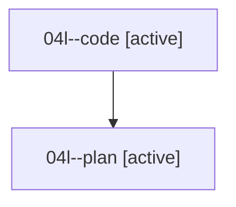

# Family: 04l

[Agent Hoods](../README.md) / [bbugyi200](../users/bbugyi200/README.md) / [athena](../users/bbugyi200/machines/athena/README.md) / [04l](../users/bbugyi200/machines/athena/hoods/04l/README.md) / 04l

Owner: `bbugyi200.athena` · Hood: `04l` · Members: 2

## Lineage

The diagram is an optional enhancement; the ordered table below contains the same lineage in accessible text.

| Role | Agent | State | Model / provider | Timing | Commits | Prompt | Chat |
|---|---|---|---|---|---:|---|---|
| code | 04l--code | active | grok-4.6 / grok | 2026-08-17T12:21:35.466201+00:00 | 0 | — | — |
| plan | 04l--plan | active | opus / claude | 2026-08-17T11:48:58.359914+00:00 | 0 | [Prompt](../agents/bbugyi200.athena.04l--plan/prompt.md) | [Chat](../agents/bbugyi200.athena.04l--plan/chat.md) |

## Commits

| Role | Repo | Commit | Subject | Committed |
|---|---|---|---|---|
| — | sase | [`3c0761f`](https://github.com/sase-org/sase/commit/3c0761f2e1c978ed48e2b2c105ac6de4c76e5044) | chore: Add SDD prompt and plan for directive\_value\_fanout | 2026-06-23 14:44:25 EDT |
| — | sase | [`6d26305`](https://github.com/sase-org/sase/commit/6d263059944d092943b17224dff6a14419104f8a) | feat: support directive value fanout | 2026-06-23 15:00:16 EDT |
