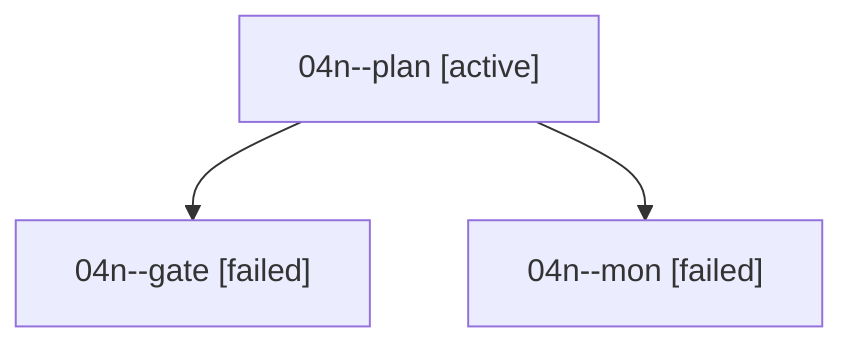

# Family: 04n

[Agent Hoods](../README.md) / [bbugyi200](../users/bbugyi200/README.md) / [athena](../users/bbugyi200/machines/athena/README.md) / [04n](../users/bbugyi200/machines/athena/hoods/04n/README.md) / 04n

Owner: `bbugyi200.athena` · Hood: `04n` · Members: 3

## Lineage

The diagram is an optional enhancement; the ordered table below contains the same lineage in accessible text.

| Role | Agent | State | Model / provider | Timing | Commits | Prompt | Chat |
|---|---|---|---|---|---:|---|---|
| plan | 04n--plan | active | claude-fable-5 / claude | 2026-09-07T18:35:25.216104+00:00 | 0 | [Prompt](../agents/bbugyi200.athena.04n--plan/prompt.md) | [Chat](../agents/bbugyi200.athena.04n--plan/chat.md) |
| gate | 04n--gate | failed | claude-fable-5 / claude | 2026-09-07T18:54:13.439050+00:00 → 2026-09-07T18:55:36.374506+00:00 | 0 | — | [Chat](../agents/bbugyi200.athena.04n--gate/chat.md) |
| mon | 04n--mon | failed | claude-fable-5 / claude | 2026-09-07T18:55:31.496788+00:00 → 2026-09-07T18:57:52.935773+00:00 | 0 | — | [Chat](../agents/bbugyi200.athena.04n--mon/chat.md) |

## Neighbors

| Agent | Relation | State |
|---|---|---|
| [04n.cdx](../agents/bbugyi200.athena.04n.cdx/README.md) | descendant | completed |
