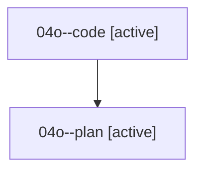

# Family: 04o

[Agent Hoods](../README.md) / [bbugyi200](../users/bbugyi200/README.md) / [athena](../users/bbugyi200/machines/athena/README.md) / [04o](../users/bbugyi200/machines/athena/hoods/04o/README.md) / 04o

Owner: `bbugyi200.athena` · Hood: `04o` · Members: 2

## Lineage

The diagram is an optional enhancement; the ordered table below contains the same lineage in accessible text.

| Role | Agent | State | Model / provider | Timing | Commits | Prompt | Chat |
|---|---|---|---|---|---:|---|---|
| code | 04o--code | active | grok-4.6 / grok | 2026-08-17T12:35:47.447880+00:00 | [1](../agents/bbugyi200.athena.04o--code/README.md#commits) | — | — |
| plan | 04o--plan | active | opus / claude | 2026-08-17T12:24:57.133871+00:00 | 0 | [Prompt](../agents/bbugyi200.athena.04o--plan/prompt.md) | [Chat](../agents/bbugyi200.athena.04o--plan/chat.md) |

## Commits

| Role | Repo | Commit | Subject | Committed |
|---|---|---|---|---|
| code | sase | [`15c6f89`](https://github.com/sase-org/sase/commit/15c6f89129db19178ec9f3221b67fdfb2c3998c7) | fix(bead): accept bead-less family members on bead work relaunch | 2026-08-17 12:54:11 UTC |
