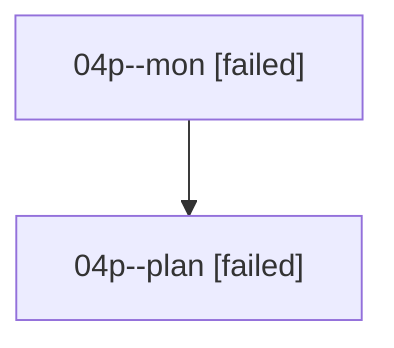

# Family: 04p

[Agent Hoods](../README.md) / [bbugyi200](../users/bbugyi200/README.md) / [athena](../users/bbugyi200/machines/athena/README.md) / [04p](../users/bbugyi200/machines/athena/hoods/04p/README.md) / 04p

Owner: `bbugyi200.athena` · Hood: `04p` · Members: 2

## Lineage

The diagram is an optional enhancement; the ordered table below contains the same lineage in accessible text.

| Role | Agent | State | Model / provider | Timing | Commits | Prompt | Chat |
|---|---|---|---|---|---:|---|---|
| mon | 04p--mon | failed | opus / claude | 2026-08-17T12:54:16.052426+00:00 | 0 | — | [Chat](../agents/bbugyi200.athena.04p--mon/chat.md) |
| plan | 04p--plan | failed | opus / claude | 2026-08-17T12:43:24.947469+00:00 | 0 | [Prompt](../agents/bbugyi200.athena.04p--plan/prompt.md) | [Chat](../agents/bbugyi200.athena.04p--plan/chat.md) |
