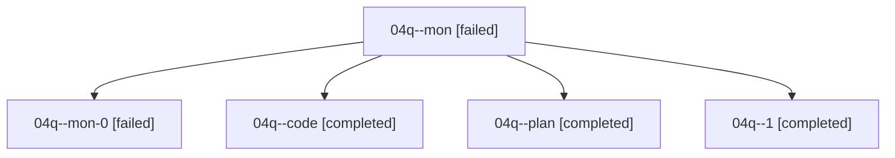

# Family: 04q

[Agent Hoods](../README.md) / [bbugyi200](../users/bbugyi200/README.md) / [athena](../users/bbugyi200/machines/athena/README.md) / [04q](../users/bbugyi200/machines/athena/hoods/04q/README.md) / 04q

Owner: `bbugyi200.athena` · Hood: `04q` · Members: 5

## Lineage

The diagram is an optional enhancement; the ordered table below contains the same lineage in accessible text.

| Role | Agent | State | Model / provider | Timing | Commits | Prompt | Chat |
|---|---|---|---|---|---:|---|---|
| mon | 04q--mon | failed | sonnet / claude | 2026-08-17T13:11:45.811040+00:00 | 0 | — | [Chat](../agents/bbugyi200.athena.04q--mon/chat.md) |
| mon-0 | 04q--mon-0 | failed | sonnet / claude | 2026-08-17T13:17:17.973271+00:00 | 0 | — | [Chat](../agents/bbugyi200.athena.04q--mon-0/chat.md) |
| code | 04q--code | completed | sonnet / claude | 2026-08-17T13:10:33.794982+00:00 | 0 | — | [Chat](../agents/bbugyi200.athena.04q--code/chat.md) |
| plan | 04q--plan | completed | opus / claude | 2026-08-17T13:04:36.074920+00:00 | 0 | [Prompt](../agents/bbugyi200.athena.04q--plan/prompt.md) | [Chat](../agents/bbugyi200.athena.04q--plan/chat.md) |
| 1 | 04q--1 | completed | sonnet / claude | 2026-08-17T13:13:28.878596+00:00 | 0 | [Prompt](../agents/bbugyi200.athena.04q--1/prompt.md) | [Chat](../agents/bbugyi200.athena.04q--1/chat.md) |
