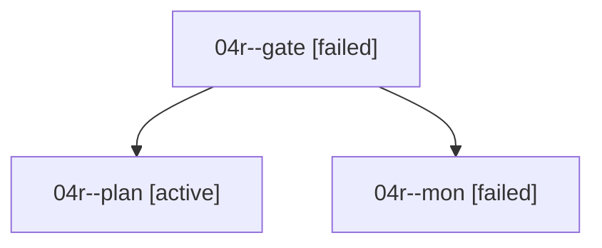

# Family: 04r

[Agent Hoods](../README.md) / [bbugyi200](../users/bbugyi200/README.md) / [athena](../users/bbugyi200/machines/athena/README.md) / [04r](../users/bbugyi200/machines/athena/hoods/04r/README.md) / 04r

Owner: `bbugyi200.athena` · Hood: `04r` · Members: 3

## Lineage

The diagram is an optional enhancement; the ordered table below contains the same lineage in accessible text.

| Role | Agent | State | Model / provider | Timing | Commits | Prompt | Chat |
|---|---|---|---|---|---:|---|---|
| gate | 04r--gate | failed | claude-fable-5 / claude | 2026-09-07T19:27:24.318127+00:00 → 2026-09-07T19:28:47.130743+00:00 | 0 | — | [Chat](../agents/bbugyi200.athena.04r--gate/chat.md) |
| plan | 04r--plan | active | claude-fable-5 / claude | 2026-09-07T19:08:33.991287+00:00 | 0 | [Prompt](../agents/bbugyi200.athena.04r--plan/prompt.md) | [Chat](../agents/bbugyi200.athena.04r--plan/chat.md) |
| mon | 04r--mon | failed | claude-fable-5 / claude | 2026-09-07T19:28:42.718828+00:00 → 2026-09-07T19:31:09.257793+00:00 | 0 | — | [Chat](../agents/bbugyi200.athena.04r--mon/chat.md) |

## Neighbors

| Agent | Relation | State |
|---|---|---|
| [04r.cld](../agents/bbugyi200.athena.04r.cld/README.md) | descendant | completed |
