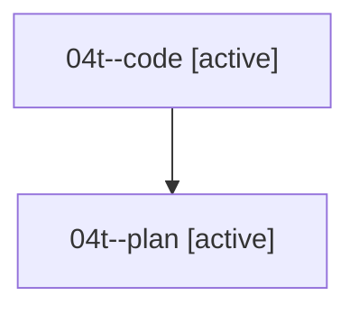

# Family: 04t

[Agent Hoods](../README.md) / [bbugyi200](../users/bbugyi200/README.md) / [athena](../users/bbugyi200/machines/athena/README.md) / [04t](../users/bbugyi200/machines/athena/hoods/04t/README.md) / 04t

Owner: `bbugyi200.athena` · Hood: `04t` · Members: 2

## Lineage

The diagram is an optional enhancement; the ordered table below contains the same lineage in accessible text.

| Role | Agent | State | Model / provider | Timing | Commits | Prompt | Chat |
|---|---|---|---|---|---:|---|---|
| code | 04t--code | active | sonnet / claude | 2026-08-17T14:43:52.422214+00:00 | [1](../agents/bbugyi200.athena.04t--code/README.md#commits) | — | — |
| plan | 04t--plan | active | opus / claude | 2026-08-17T14:26:39.438331+00:00 | 0 | [Prompt](../agents/bbugyi200.athena.04t--plan/prompt.md) | [Chat](../agents/bbugyi200.athena.04t--plan/chat.md) |

## Commits

| Role | Repo | Commit | Subject | Committed |
|---|---|---|---|---|
| — | sase | [`f2f80b2`](https://github.com/sase-org/sase/commit/f2f80b29312ec04c1e76ee1991fecd170ff35ec3) | chore: Add SDD prompt and plan for prompt\_number\_increment | 2026-06-23 22:25:22 UTC |
| — | sase | [`9e19bdb`](https://github.com/sase-org/sase/commit/9e19bdb286296530d46d51563eb4942a6b9aded1) | feat(ace): support vim number increment commands | 2026-06-23 22:37:20 UTC |
| code | sase | [`0229e38`](https://github.com/sase-org/sase/commit/0229e3881d4edf1b678832796f99cdfb966126c6) | fix(ace-tui): correct inaccurate Statistics tab data and metric definitions | 2026-08-17 15:29:32 UTC |

## Neighbors

| Agent | Relation | State |
|---|---|---|
| [04t.w1](../agents/bbugyi200.athena.04t.w1/README.md) | descendant | completed |
